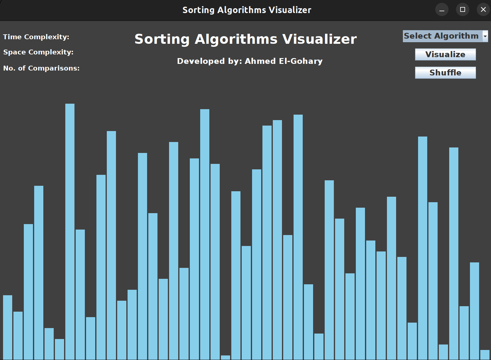

# Sorting Algorithms Visualizer
A visualization tool for different sorting algorithms including Merge Sort, Heap Sort, Insertion Sort and Bubble Sort

You can see it in action [here](https://www.youtube.com/watch?v=N3b7arzxR3k)



## Installation
### Linux (Ubuntu)
First update your apt package manager
```bash
sudo apt update
```
Next, check if Java is already installed:
```bash
javac -version
```

If Java is not already installed, you'll get the following message
```bash
Output
Command 'java' not found, but can be installed with:

sudo apt install default-jre              # version 2:1.11-72build1, or
sudo apt install openjdk-11-jre-headless  # version 11.0.14+9-0ubuntu2
sudo apt install openjdk-17-jre-headless  # version 17.0.2+8-1
sudo apt install openjdk-18-jre-headless  # version 18~36ea-1
sudo apt install openjdk-8-jre-headless   # version 8u312-b07-0ubuntu1
```

Execute the following command to install the JDK:
```bash
sudo apt install default-jdk
```

Verify that the JDK is installed by checking the version of javac, the Java compiler:
```bash
javac -version
```
If successful You’ll see the following output:
```bash
Output
javac 11.0.14
```

## Usage
Clone the repo then compile and run Main.java

